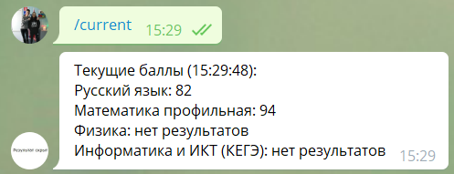

# Intro

Все проекты были сделаны для получения полезного опыта, а так же локального пользования для друзей. Не считаю их большим достижением, но я узнал много нового и готов развиваться в разработке далее.

## DNS extension

```
Made with js
```
Работает на запросах, добавляет товар в корзину, формирует заказ, выбирая магазин по кейворду, либо выбирая стандартный магазин для профиля.


## DNS monitor

```
Made with nodejs
```
Монитор, который выкладывает сток товаров в категории с определенными ценовыми ограничениями на сервер, для дальнейшей работы днс бота.


## Supreme bot

```
Made with python requests + selenium + some js for autofill
```
Selenium нужен для ввода 3ds, харвестить капчу я умею, с ловлей виджета оплаты уже начал разбираться.


## Adidas Raffle bot

```
Made with python selenium
```
Присутствует создание и редактирование профилей и тасков, есть фарм куки (он приведен в демонстрации).

Отсутствует интеграция реквестов, но все необходимые запросы уже отслежены, осталась реализация.
Работает также и в хедлесс.


## checkEge bot

```
python telebot + requests
```
Телеграм бот для получения результатов егэ, мониторинга изменений в результатах.

http://t.me/egeResultsByDrDreBot
(сейчас отключен за ненадобностью, могу включить для демонстрации)



## adidasStock bot

```
python telebot + requests
```
Телеграм бот, выдающий сток всех сайзов товара по ссылке на него

http://t.me/adidasStockBot
(сейчас отключен за ненадобностью, могу включить для демонстрации)


